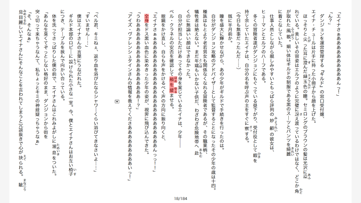
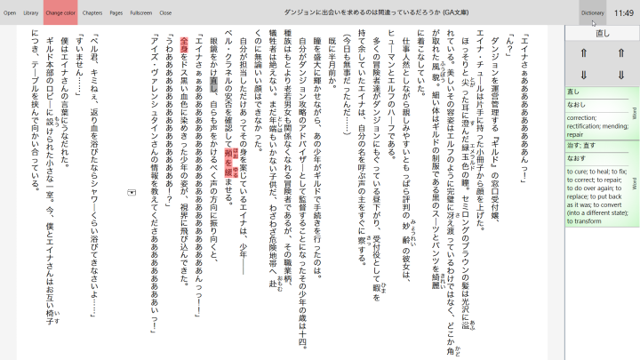

# Main features:
### Touch-compatibilty
    No tiny buttons and context menus
### Vertical Japanese text
    Also displays ruby/furigana correctly
### Fast
    No waiting times when changing reader size
### Ability to mark text
    Three colors possible
### Tense-sensitive dictionary
    Uses grammar tables to find possible base forms of conjugated words, and searches for all of them.
    Lookup is very fast, although the dictionary needs a few seconds to load (<5) at startup.

# Additional features:
    Library function
    Ability to skip to chapters
    Ability to easily jump between pages
    Ability to load pictures with a non-local(internet) source,
    which can happen when converting web pages to epub.
    Can replace all Hiragana with Katakana through option in
    the save file, useful if you're bad at Katakana

# Downsides:
### Only vertical Japanese text
    This Epub-reader only displays text in a vertical, right-to-left layout and
    the dictionary only works with Japanese. Using this reader with books not written
    in Japanese is not recommended, although Chinese may work.
### Special rendering
    This is not an epub-reader in the normal sense.
    Usually the html-files inside the epub are displayed using an html-renderer,
    which (I think so at least, I can't think of any other reason why so many reader-programms
    are so slow) makes everything quite slow, because the reader has to render
    the entire book at the same time in order to calculate the page count.
    This reader does something that looks very similar to a normal html-renderer,
    as long as you don't encounter html-elements that are uncommon in books, e.g tables.
    This custom rendering is very fast.
	

# Current Development:
	I am currently reworking the rendering and positioning.
	
	As for the positioning-rework:
	Reason for this is that I want to reduce GC-load when rendering.
	This won't change the user experience much, but it will reduce RAM-usage.
	I have already finished this part, although the RAM-usage is still quite
	high because of the dictionary, which has around 400k entries.
	
	
	The rendering rework will have a miniscule impact on user experience, here I am
	implementing the font rendering in d2d using c++.
	I am doing this because I have noticed that the first few text pages take
	too long (still less than 1 second) to load.
	There seems to be some kind of buffering going on, but I can't catch it.
	
	
# Releases:

	Only 64 bit for now, @me if you want 32 bit or other stuff.